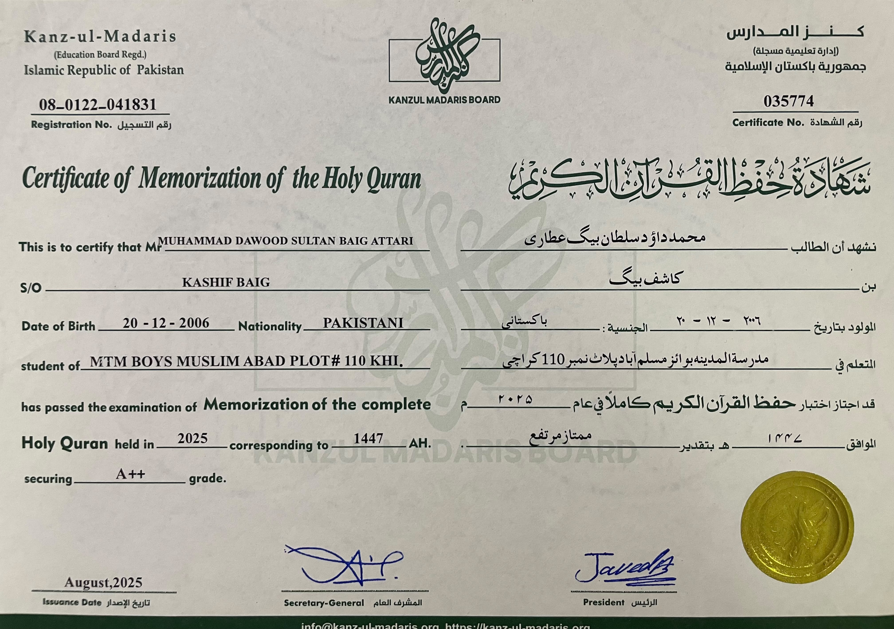
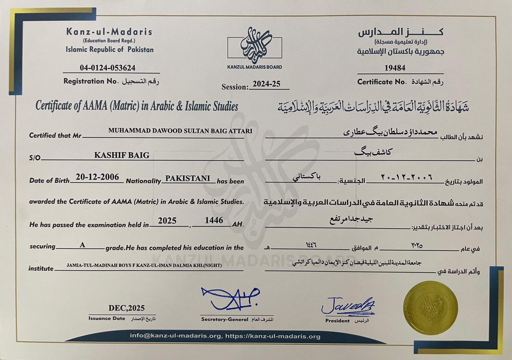
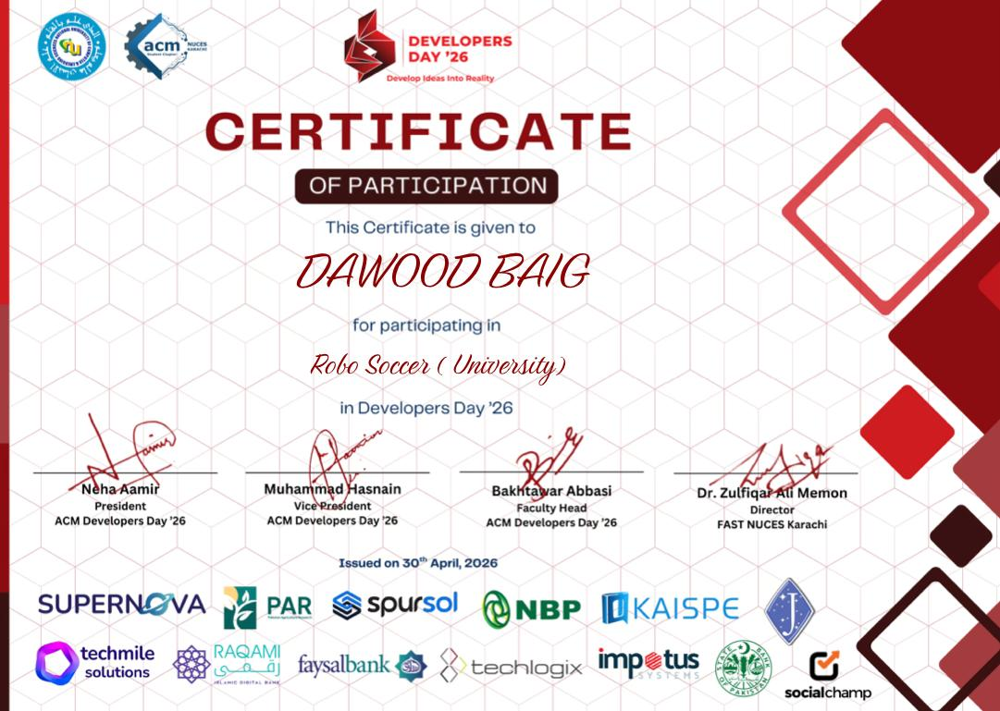
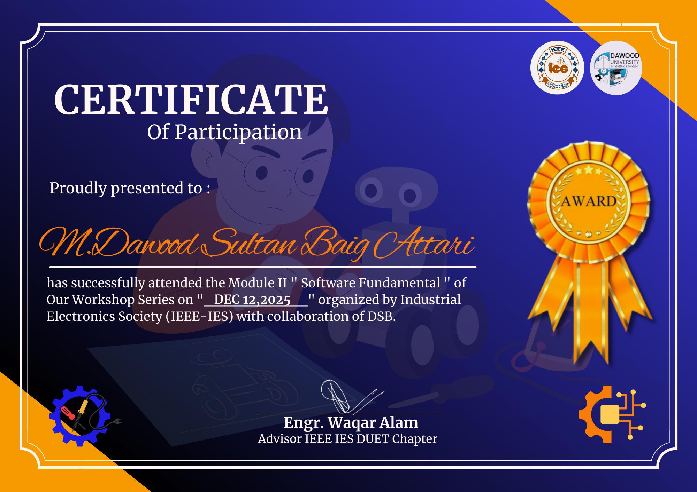

# 📜 My Certificates

Here are some of my certificates of technical, academic and professional achievement that I have acquired on my learning journey.

## Technical Workshops

- Arduino Workshop
Software Fundamentals Workshop (IEEE IES DUET)
RoboSoccer Competition will be held on ‘Developers Day'26.RoboSoccer Competition is going to be held in ‘Developers Day'26.

## Academic Achievements

- Certificate of memorization of the Holy Quran (Hifz-ul-Quran)
- AAMA (Matric) in Arabic & Islamic Studies

## Currently Learning

- Embedded Systems
- Robotics
- ESP32
- IoT
- AI for Engineering

I am always striving to become better in academic and technical aspects.
## Preview

### 🏆 Hifz-ul-Quran

---

### 📖 AAMA (Arabic & Islamic Studies)

---

### 🤖 RoboSoccer Competition

---

### 💻 Software Fundamentals Workshop

---

### 🔧 Arduino Workshop

